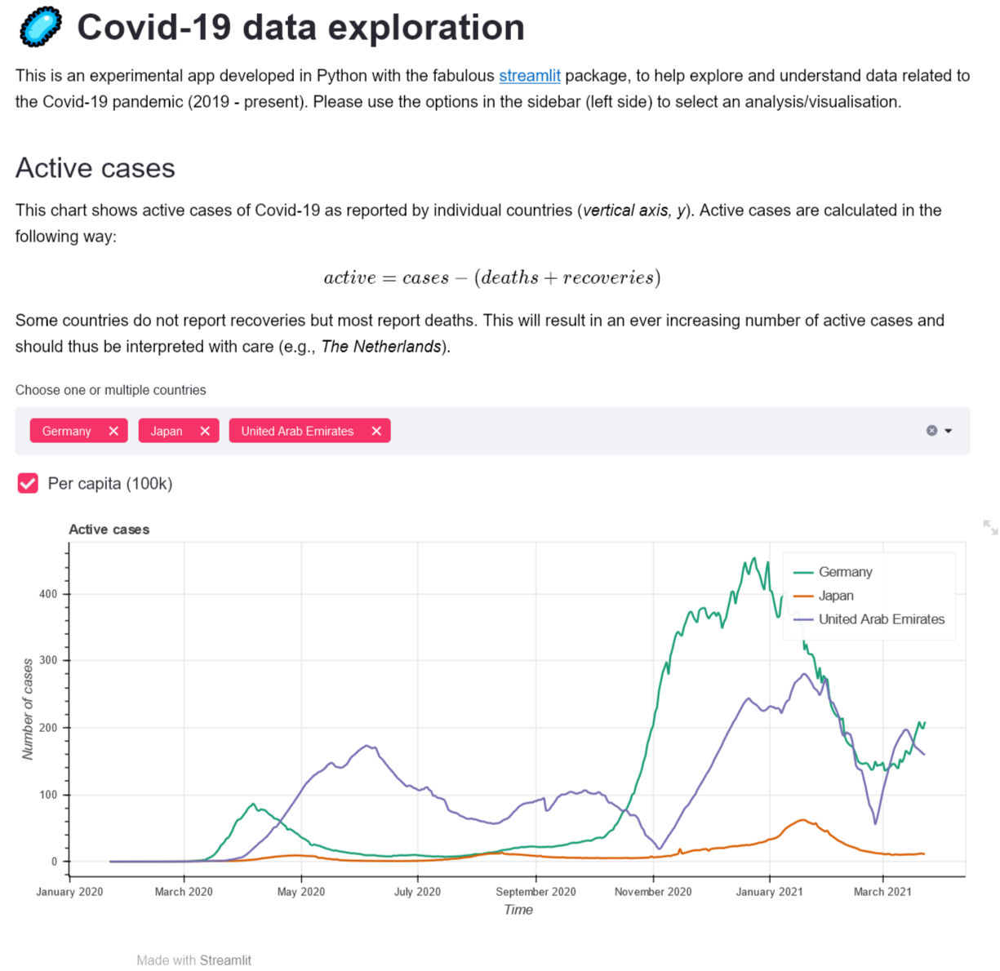

This is an experimental and interactive streamlit app to explore data related to Covid-19.

Data sources:
* [Johns Hopkins University](https://github.com/CSSEGISandData/COVID-19)   
* [Worldometers](https://worldometers.info)